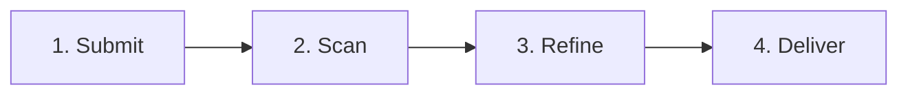

# research-assistant

# 🤖 AI-Powered Research Synthesizer

> **Tired of spending hours digging through endless research papers and articles? Let AI do the heavy lifting.**

Our smart application transforms your raw data, notes, or topics into instant, actionable insights. By combining deep-web research with advanced AI summarization, we deliver the exact knowledge you need—without the clutter.

---

## 🚀 How It Works



1. **Submit:** Drop in your raw data or topics.
2. **Scan:** AI crawls global databases for the latest articles.
3. **Refine:** Advanced agents extract the exact core findings.
4. **Deliver:** You get crisp, bite-sized summaries with reliable citations.

---

## ✨ Key Benefits

* 🕒 **Save hours daily:** Skip the manual literature search process entirely.
* 📈 **Stay ahead:** Access the absolute latest research papers instantly.
* ⚡ **Read in minutes:** Grasp complex studies via high-utility summaries.
* 📚 **Never lose track:** Clear article names and citations provided for easy referencing.

---

## 💡 Perfect For

* **Researchers:** Accelerate your literature reviews and source gathering.
* **Professionals:** Stay on top of industry trends effortlessly.
* **Students:** Master complex topics and find citations fast.

---

## 🛠️ Getting Started

### Prerequisites
* Python 3.10+ / Node.js (Adjust based on your tech stack)
* API Keys (e.g., OpenAI, SerpAPI)

### Installation
1. Clone the repository:
   ```bash
   git clone https://github.com
   ```
2. Install dependencies:
   ```bash
   pip install -r requirements.txt
   ```
3. Run the application:
   ```bash
   python main.py
   ```


